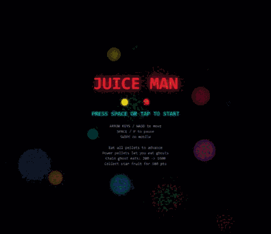

# JUICE-||||| **v6** | Bryce | [Play](levels/level_1_v6.html) | Level 1 — v6 |
| v6 | 2026-05-26 | Bryce | Level 1 — v6 |
 **v5** | Bryce | [Play](levels/level_1_v5.html) | Level 1 — v5 |
| v5 | 2026-05-18 | Bryce | Level 1 — v5 |
 **v4** | Bryce | [Play](levels/level_1_v4.html) | Level 1 — v4 |
| v4 | 2026-05-15 | Bryce | Level 1 — v4 |
 **v3** | Bryce | [Play](levels/level_1_v3.html) | Level 1 — v3 |
 **v0** | Bryce | [Play](levels/level_1_v0.html) | Level 1 — v0 |
MAN

Humanity is seeking AGI. Neat idea if you ask me. But a higher aspiration is to bring humanity together to accomplish its greatest purpose: Make the JUICIEST version of PAC-MAN that ever existed. A democratic, collaborative effort. AI can do a lot of things. It can make juice, but it can't feel it in its bones. Because AI bones are too squishy, made out of a mix of perceptrons and JELL-O. So we must come together as humankind and utilize AI together to make the juiciest version of PAC-MAN: JUICE-MAN. Can you make it juicier? 

PAC-MAN's final form is coded in the latest and greatest programming language: Markdown. If you can write english (or non-english) sentences to describe juice, you can participate.

> This is not JUICE-MAN. It's inspiration from a parallel universe. Play the inspiration: [juice_man_inspiration.html](https://brycecovert.github.io/JUICE-MAN/juice_man_inspiration.html)

## Current Status

Nightly builds active. Latest: **Level 1 v6** — Level 1 — v6

Open a PR with a spec to participate.

## How It Works

1. **Open a PR** with a spec file at `specs/level_n/v$(cat next_version).md` describing your desired changes (max 300 words).
2. **Vote** by adding thumbs up to PRs. The PR with the most votes wins.
3. **AI generates** the next version automatically via GitHub Action.
4. **Play** the nightly builds starting May 10, 2026.

## Level System

JUICE-MAN is split into **levels**, each with 10 versions (v0–v9). Each level has its own `.html` file. Completing a level redirects to the next.

JUICE-MAN is **NOT a walled garden**. It stands for freedom, liberty, and justice for all. Each level is provided by a different open-weight model — no corporate lock-in, no closed systems.

| Level | Model | Theme | Status |
|-------|-------|-------|--------|
| 1 | Qwen-3.6-27B | Prismatic arcade evolution | Active — accepting v3+ specs |
| 2+ | TBD | TBD | Not yet started |

### Theme Voting

When a new level opens, the first round of PRs propose themes. The winning theme sets the creative direction for that level's 10 versions. GO FLIPPIN CRAZY. 3D JUICE-MAN? Please. Surfing JUICE-MAN? Sign me up brother.

## PR Rules

1. **Max 300 words** — Spec files must not exceed 300 words.
2. **Additive only** — Cannot undo anything from a previous PR unless that PR broke something.
3. **Must be SFW** — No explicit, offensive, or inappropriate content.
4. **Respect the theme** — Each level has a theme decided in the first round of PRs.
5. **Spirit of the law** — The rules are easy to game. But that won't be fun.

## Official Releases (per level)

### Level 1

| Version | Author | Play | Description |
|---------|--------|------|-------------|
| **v0** | brycecovert | [Play](levels/level_1_v0.html) | Clean baseline — standard Pac-Man with no visual effects. The starting point for all juice. |
| **v1** | brycecovert | [Play](levels/level_1_v1.html) | Shape flash bg and screen shake on death |
| **v2** | brycecovert | [Play](levels/level_1_v2.html) | Prismatic burst combo system with chromatic particle explosions |
| **v3** | ? | — | Coming soon — open a PR to compete! |

## JUICE-MAN forks

| Fork | Author | Play | Description |
|------|--------|------|-------------|
| Inspiration | brycecovert | [juice_man_inspiration.html](https://brycecovert.github.io/JUICE-MAN/juice_man_inspiration.html) | Parallel universe version — space theme, neon walls, particles, and aggressive FX. Not part of the official competition. |
| *(yours?)* | — | — | Fork this repo, write a spec, and open a PR! |

## Release Log

| Version | Date | Juice-Man | Changes |
|---------|------|-----------|---------|
| v3 | 2026-05-14 | Bryce | Level 1 — v3 |
| v0 | 2026-05-13 | Bryce | Level 1 — v0 |
| v0 | May 1, 2026 | brycecovert | Clean Pac-Man baseline. No effects. Standard maze, ghosts, pellets, power-ups, fruit, scoring, lives, levels. |
| v1 | May 6, 2026 | brycecovert | Shape flash bg and screen shake on death |
| v2 | May 12, 2026 | brycecovert | Prismatic burst combo system with chromatic particle explosions |

## Credits

Authors who contribute to each level are automatically added to `credits/level_N_credits.md`.
